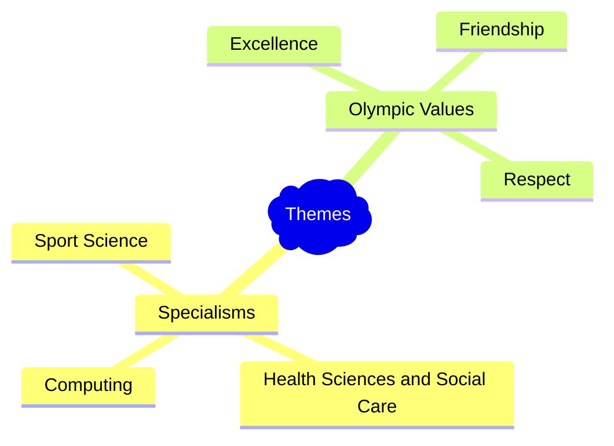

## Start your art project

## Our Aim
To create web based art on the themes of [UTC Sheffield OLP](https://www.utcsheffield.org.uk/olp/)   
Either our Educational Specialisms or the Olympic Values

---

## [current art on screens](https://utcsheffield.github.io/olp-hydra-art/)

<iframe src="https://utcsheffield.github.io/olp-hydra-art/" allow="fullscreen" allowfullscreen="" style="height:100%;width:100%; aspect-ratio: 16 / 9; "></iframe>

---
### Specialisms
- **Computing**
- **Health Sciences & Social Care**
- **Sport Science**

---
### Olympic Values

- **Excellence** - someone doing the best they can, in sport and in life. It is about taking part and striving for improvement, not just winning.​
- **Friendship** - using sport and to develop tolerance and understanding between all people – performers, spectators and citizens generally.​
- **Respect** - having consideration for oneself, others and the wider environment. It includes respecting the rules of sport and the officials who uphold them.

---
## Your thoughts

Sketch down your ideas, on paper or electronically.

---
## Gather what you will need

You will probably need some pictures / videos or text on your theme. Find those on line from sources where you have permission to use things. Like the "Creative Commons Licenses" filter in the Google Images Tools. 

![[Pasted image 20250122111755.png|700]]

---

# Next Time

[[Session 4 - Do your project]]
