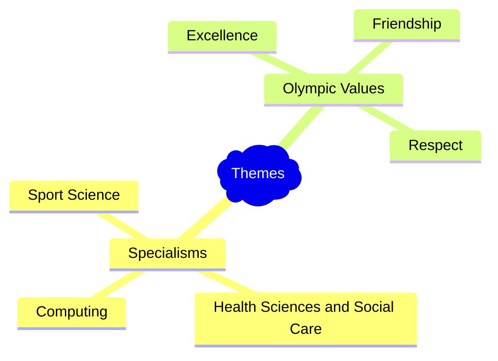

## Start your art project

![[Art Brief]]

---
## Your thoughts

Sketch down your ideas, on paper or electronically.

---
## Gather what you will need

You will probably need some pictures / videos or text on your theme. Find those on line from sources where you have permission to use things. Like the "Creative Commons Licenses" filter in the Google Images Tools. 

![[Pasted image 20250122111755.png|700]]

---

# Next Time

[[Session 4 - Do your project]]
